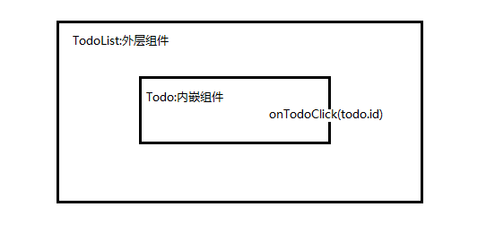
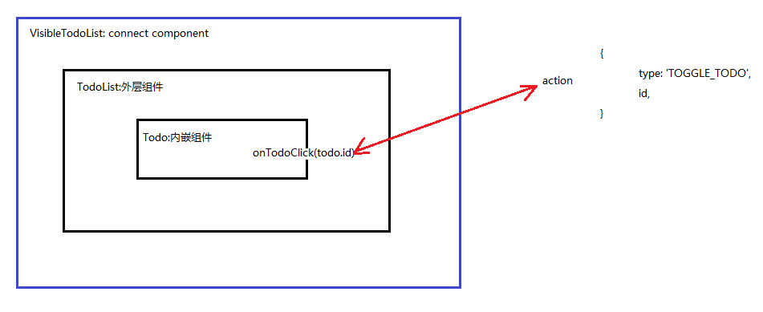
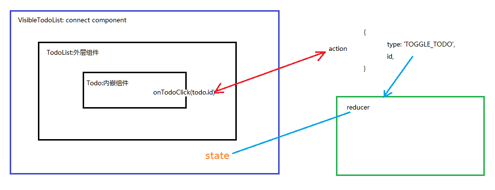

当点击todo项， todo项的状态就发生改变。分析一下如何实现的。

 

> src/components/TodoList.js

 

	import React, { PropTypes } from 'react';
	import Todo from './Todo';
	
	const TodoList = ({ todos, onTodoClick }) => (
	  <ul>
	    {todos.map(todo =>
	      <Todo
	        key={todo.id}
	        {...todo}
	        onClick={() => onTodoClick(todo.id)}
	      />
	    )}
	  </ul>
	);
	
	TodoList.propTypes = {
	  todos: PropTypes.arrayOf(PropTypes.shape({
	    id: PropTypes.string.isRequired,
	    completed: PropTypes.bool.isRequired,
	    text: PropTypes.string.isRequired,
	  }).isRequired).isRequired,
	  onTodoClick: PropTypes.func.isRequired,
	};
	
	export default TodoList;

当点击todo项，就触发onClick事件，交给onTodoClick(todo.id)来做。

> src/components/VisibleTodoList.js

 

可以看作是一个connect component,把TodoList的onTodoClick事件与某个action映射起来。

	...
	const mapDispatchToProps = (dispatch) => ({
	  onTodoClick(id) {
	    dispatch(toggleTodo(id));
	  },
	});
	
	const VisibleTodoList = withRouter(connect(
	  mapStateToProps,
	  mapDispatchToProps
	)(TodoList));

 

> src/actions/index.js

 

	...
	export const toggleTodo = (id) => ({
	  type: 'TOGGLE_TODO',
	  id,
	});

然后就是根据action返回的结果，在reducer中更改状态。

 

> src/reducers/todo.js

 

	...
	const todo = (state, action) => {
	  switch (action.type) {
	    case 'ADD_TODO':
	      return {
	        id: action.id,
	        text: action.text,
	        completed: false,
	      };
	    case 'TOGGLE_TODO':
	      if (state.id !== action.id) {
	        return state;
	      }
	      return {
	        ...state,
	        completed: !state.completed,
	      };
	    default:
	      return state;
	  }
	};

现在，**终于可以总结一下点击todo项发生了什么**。

 

1. 点击todo项，触发onClick事件
2. 冒泡搜索onTodoClick事件
3. 触发某个action
4. action返回的结果交给reducer, 通过reducer来更改状态

 

> src/components/VisibleTodoList.js

 

mapDispatchToProps很好，它显式调用了action。

	const mapDispatchToProps = (dispatch) => ({
	  onTodoClick(id) {
	    dispatch(toggleTodo(id));
	  },
	});

 

实际上，还可以把connect component的属性与action的映射，配置到connnect中去：

	//const mapDispatchToProps = (dispatch) => ({
	//  onTodoClick(id) {
	//    dispatch(toggleTodo(id));
	//  },
	//});
	
	const VisibleTodoList = withRouter(connect(
	  mapStateToProps,
	 { onTodoClick: toggleTodo }
	)(TodoList));
 

完整如下：

	import { connect } from 'react-redux';
	import { withRouter } from 'react-router';
	import { toggleTodo } from '../actions';
	import TodoList from './TodoList';
	
	const getVisibleTodos = (todos, filter) => {
	  switch (filter) {
	    case 'all':
	      return todos;
	    case 'completed':
	      return todos.filter(t => t.completed);
	    case 'active':
	      return todos.filter(t => !t.completed);
	    default:
	      throw new Error(`Unknown filter: ${filter}.`);
	  }
	};
	
	const mapStateToProps = (state, { params }) => ({
	  todos: getVisibleTodos(state.todos, params.filter || 'all'),
	});
	
	//const mapDispatchToProps = (dispatch) => ({
	//  onTodoClick(id) {
	//    dispatch(toggleTodo(id));
	//  },
	//});
	
	const VisibleTodoList = withRouter(connect(
	  mapStateToProps,
	 { onTodoClick: toggleTodo }
	)(TodoList));
	
	export default VisibleTodoList;

 

