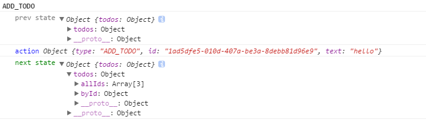

我们知道，当页面更上触发某个事件，会调用某个action,然后action返回的结果会给到reducer, reducer帮助我们更改状态。

 

而实际上，是createStore的dispatch方法在起作用。我们也大致知道：dispatch做2件事，一件事是更改状态，另一件事是把createStore注册的事件重新执行一遍。而本篇，就像看看dispatch的影响力，即每次dispatch,状态到底是如何变化的。

 

> src/configureStore.js

 

	import { createStore } from 'redux';
	import throttle from 'lodash.throttle';
	import todoApp from './reducers';
	import { loadState, saveState } from './localStorage';
	
	const addLogginToDispatch = (store) => {
	    const rawDispatch = store.dispatch;
	    
	    if(!console.group){
	        return rawDispatch;
	    }
	    
	    return (action) => {
	        console.group(action.type);
	        console.log('%c prev state', 'color:gray', store.getState());
	        console.log('%c action', 'color: blue',  action);
	        const returnValue = rawDispatch(action);
	        console.log('%c next state', 'color: green',store.getState());
	        console.groupEnd(action.type);
	        return returnValue;
	    };
	};
	
	
	const configureStore = () => {
	  const persistedState = loadState();
	  const store = createStore(todoApp, persistedState);
	
	  if(process.env.NODE_ENV !== 'production'){
	      store.dispatch = addLogginToDispatch(store);
	  }
	  
	
	  store.subscribe(throttle(() => {
	    saveState({
	      todos: store.getState().todos,
	    });
	  }, 1000));
	
	  return store;
	};
	
	export default configureStore;

其实就是对createStore的dispatch方法重新定义了一下。

 

> localhost:3000

 

添加项，再点击按钮。

dispatch的影响力(针对状态的改变)，显而易见。

 

