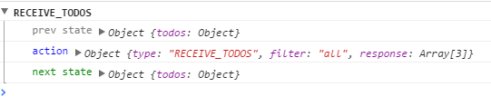

在上一节中，已经能把获取到的数据打印到控制台上，本篇要做的是：当接受到数据，触发action。

 
我们似乎只要做2件事就可以了：

1. 当VisibleTodoList组件发生componentDidMount,componentDidUpdate事件的时候触发组件的一个属性方法
2. 而组件的这个属性方法必须和action映射起来

 

> src/components/VisibleTodoList.js

 
首先是发生组件的2个生命周期事件的时候，执行fetchData方法：

    componentDidMount(){
        this.fetchData();
    }
    
    componentDidUpdate(prevProps){
        if(this.props.filter !== prevProps.filter){
            this.fetchData();
        }
    }
    
    fetchData(){
        const { filter, receiveTodos } = this.props;
        fetchTodos(filter).then(todos => 
            receiveTodos(filter, todos)                                
        );
    }

 
receiveTodos既然是组件的方法，那也必须和action映射起来：

	VisibleTodoList = withRouter(connect(
	  mapStateToProps,
	 { onTodoClick: toggleTodo, receiveTodos }
	)(VisibleTodoList));

 

完整是这样的：

	import { connect } from 'react-redux';
	import { withRouter } from 'react-router';
	import { toggleTodo, receiveTodos } from '../actions';
	import TodoList from './TodoList';
	import { getVisibleTodos } from '../reducers';
	import { fetchTodos } from '../api';
	import React, { Component } from 'react';
	
	class VisibleTodoList extends Component{
	    
	    componentDidMount(){
	        this.fetchData();
	    }
	    
	    componentDidUpdate(prevProps){
	        if(this.props.filter !== prevProps.filter){
	            this.fetchData();
	        }
	    }
	    
	    fetchData(){
	        const { filter, receiveTodos } = this.props;
	        fetchTodos(filter).then(todos => 
	            receiveTodos(filter, todos)                                
	        );
	    }
	    
	    
	    render(){
	        return <TodoList {...this.props} />
	    }
	}
	
	
	const mapStateToProps = (state, { params }) => {
	    const filter = params.filter || 'all';
	    return {
	        todos: getVisibleTodos(state, filter),
	        filter
	    }
	};
	
	
	
	VisibleTodoList = withRouter(connect(
	  mapStateToProps,
	 { onTodoClick: toggleTodo, receiveTodos }
	)(VisibleTodoList));
	
	export default VisibleTodoList;

 

> src/actions/index.js

 

	import { v4 } from 'node-uuid';
	
	export const receiveTodos = (filter, response) => ({
	    type: 'RECEIVE_TODOS',
	    filter,
	    response,
	});
	
	
	export const addTodo = (text) => ({
	  type: 'ADD_TODO',
	  id: v4(),
	  text,
	});
	
	
	
	export const toggleTodo = (id) => ({
	  type: 'TOGGLE_TODO',
	  id,
	});

 

> localhost:3000

 

 

    

